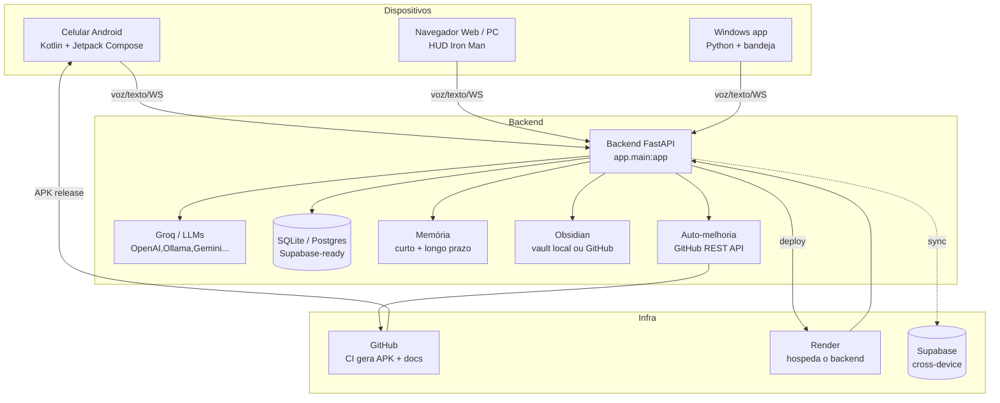

# Arquitetura — NEXUS AI (JARVIS)

Assistente pessoal multiplataforma. O "JARVIS" é a personalidade (voz/UI);
o "NEXUS" é o sistema/backend.

## Visão geral

## Camadas

1. **Clientes**
   - **Android**: chat por voz, wake word "Jarvis", abertura de apps, música,
     lembretes, acessibilidade. Compila via CI do GitHub (APK assinado).
   - **Web HUD**: tela Iron Man no PC, reconhecimento contínuo "Jarvis", TTS,
     botão "Melhorar". Servido pelo próprio backend.
   - **Windows** (planejado): bandeja, atalhos, automações.

2. **Backend (FastAPI)**
   - Auth JWT (`/api/auth`), chat streaming WS (`/api/ws/chat`) + REST (`/api/chat`).
   - Plugins: Spotify/YouTube (música), controle de sistema.
   - Memória híbrida (curto + longo prazo) em `core/memory.py`.
   - Auto-melhoria segura em `api/agent.py` (backup tag + rollback automático,
     só altera código de app/backend/web — nunca CI/segredos).
   - Obsidian em `services/obsidian.py` (vault local ou GitHub).

3. **Dados**
   - `SQLite` por padrão (Render efêmero). `Supabase` opcional (schema em
     `supabase/schema.sql`) para persistência e cross-device.
   - RLS garante que cada usuário só enxerga os próprios dados.

4. **Infra**
   - **GitHub**: CI `build.yml` gera APK (release `nexus-ai-N`) e `test-backend.yml`
     roda os testes.
   - **Render**: hospeda o backend (auto-deploy ao fazer push em `main`).
   - **Supabase**: banco/Auth/Storage para sincronização entre dispositivos.

## Fluxo de uma fala
1. Usuário diz "Jarvis, ..." no celular ou PC.
2. Wake word detectada → comando enviado ao backend (WS).
3. Backend monta o contexto (memória + vault Obsidian) e chama o LLM.
4. Resposta transmitida (WS) e falada (TTS nativo no Android / browser no PC).
5. Fatos duráveis são extraídos para a memória de longo prazo.

## Segurança
- JWT para autenticação; senha com hash (SHA-256); token do GitHub criptografado
  no banco.
- Auto-melhoria restrita a pastas permitidas; rollback automático em falha.
- RLS no Supabase; CORS configurado; nenhum segredo fixo em código.

## Status (resumo)
| Módulo | Estado |
|--------|--------|
| Android (voz, wake word, apps, música) | ✅ funcionando |
| Web HUD (PC, "Jarvis" contínuo) | ✅ funcionando |
| Backend IA (Groq) | ✅ funcionando |
| Auto-atualização APK + auto-melhoria | ✅ funcionando (com backup) |
| Obsidian (local + GitHub) | ✅ funcionando |
| Supabase (estrutura pronta) | 🟡 pronto p/ plugar (sem tokens ainda) |
| Windows app | 🟡 v1 criado (`windows/`, Python + bandeja) |
| Smart TV / Linux | 🟡 planejado |
