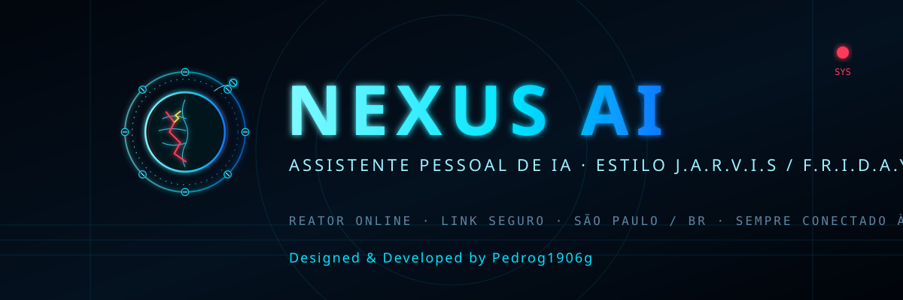

<p align="center">
  
</p>

<p align="center">
  
  
  
  
  
</p>

<h1 align="center">NEXUS AI</h1>

<p align="center">
  <b>Assistente pessoal de Inteligência Artificial</b> — estilo <b>J.A.R.V.I.S.</b> / <b>F.R.I.D.A.Y.</b><br/>
  HUD futurista · Cyberpunk · Interface militar · IA avançada
</p>

---

## 📑 Índice

- [Sobre](#sobre)
- [Demonstração](#demonstração)
- [Funcionalidades](#funcionalidades)
- [Arquitetura](#arquitetura)
- [Tecnologias](#tecnologias)
- [Estrutura do Projeto](#estrutura-do-projeto)
- [Instalação](#instalação)
- [Configuração](#configuração)
- [Deploy](#deploy)
- [Roadmap](#roadmap)
- [FAQ](#faq)
- [Créditos](#créditos)
- [Licença](#licença)

---

## Sobre

O **NEXUS AI** é um assistente pessoal de IA inspirado no J.A.R.V.I.S. do Homem de Ferro.
O **JARVIS** é a personalidade (voz masculina, calma, elegante, em português do Brasil); o
**NEXUS** é o sistema/backend que faz tudo funcionar.

Funciona integrado entre **Android**, **Navegador Web (PC)**, **Windows**, **GitHub**,
**Render** e **Supabase/Obsidian** (sincronização entre dispositivos).

> 🧠 *Identidade visual:* o símbolo oficial é um **cérebro cibernético em falha** — parafusos
> sendo lançados, peças metálicas voando, rachaduras, faíscas elétricas e circuitos aparentes —
> representando a "mente" da IA em constante processamento.

## Demonstração

Veja a apresentação completa do projeto (HUD interativa, status do sistema e módulos):

➡️ **[Abrir Demo (demo/index.html)](demo/index.html)**

Ou acesse o HUD ao vivo: **https://nexus-api-2o1y.onrender.com/**

## Funcionalidades

- 🤖 **Conversa por voz e texto** (PT-BR), respostas concisas (1–4 frases).
- 🎙️ **Wake word "Jarvis"** no celular e no PC (escuta contínua).
- 📱 **Android:** abrir apps, tocar música, lembretes, ler tela/notificações.
- 🖥️ **HUD Iron Man no PC** (reconhecimento contínuo + TTS do navegador/sistema).
- 🌐 **Sempre busca na internet** antes de responder (informação em tempo real).
- 🧠 **Memória de longo prazo** — o JARVIS aprende e lembra de verdade.
- 🗓️ **Lembretes** e agendamentos.
- 🔗 **Integrações:** e-mail (SMTP), Obsidian (segundo cérebro), Spotify, GitHub.
- ⚙️ **Auto-melhoria:** o próprio JARVIS analisa, melhora e versiona o código.

## Arquitetura

```
┌────────────┐   ┌────────────┐   ┌────────────┐
│  Android   │   │ Web (HUD)  │   │ Windows EXE│
└─────┬──────┘   └─────┬──────┘   └─────┬──────┘
      └────────────────┼────────────────┘
                       ▼
              ┌────────────────────┐
              │  Backend (FastAPI) │  ← Render (nuvem)
              │  WebSocket / REST  │
              └─────────┬──────────┘
        ┌──────────────┼──────────────────┐
        ▼              ▼                  ▼
    Groq (LLM)   Banco (SQLite/      Obsidian /
                              Postgres)      Supabase
```

Detalhes em [`ARCHITECTURE.md`](ARCHITECTURE.md).

## Tecnologias

| Camada      | Stack                                                        |
|-------------|-------------------------------------------------------------|
| Backend     | Python · FastAPI · SQLAlchemy · WebSockets · Uvicorn        |
| IA          | Groq (Llama) · OpenAI · Ollama · Anthropic · Gemini (plugáveis) |
| Web / HUD   | HTML · CSS · JavaScript puro · Web Speech API               |
| Windows     | Python · Tkinter · System.Speech (SAPI) · PyInstaller       |
| Android     | Kotlin · Jetpack · Acessibilidade · Notification Listener    |
| Deploy      | Render · GitHub Actions (CI de builds EXE/APK)              |
| Dados       | SQLite / Postgres · Supabase · Firebase (opcional)           |

## Estrutura do Projeto

```
NEXUS-AI/
├── assets/            # Identidade visual (logo.svg, banner.svg)
├── demo/              # Página de apresentação (demo/index.html)
├── backend/           # API FastAPI (servidor / cérebro)
├── web/               # HUD web (index.html)
├── windows/           # App do PC (EXE)
├── android/           # App do celular (APK)
├── nexus-llm-wiki/    # Documentação viva (segundo cérebro)
├── supabase/          # Schema do banco
├── docs/              # Documentação adicional
├── ARCHITECTURE.md
├── CHANGELOG.md
├── ROADMAP.md
├── CONTRIBUTING.md
├── SECURITY.md
├── LICENSE
├── render.yaml
└── README.md
```

## Instalação

### Backend (servidor)

```bash
cd backend
pip install -r requirements.txt
cp .env.example .env   # ajuste as variáveis
uvicorn app.main:app --host 0.0.0.0 --port 8000
```

### Web (HUD)

Abra `web/index.html` ou aponte para a URL do backend (`/`).
Também disponível em **https://nexus-api-2o1y.onrender.com/**.

### Windows (EXE)

Baixe o `JARVIS.exe` mais recente em
[Releases](https://github.com/Pedrog1906g/Jarvis/releases) e execute.

### Android (APK)

Baixe o `app-release.apk` mais recente em
[Releases](https://github.com/Pedrog1906g/Jarvis/releases) e instale no celular.

## Configuração

Variáveis de ambiente (ver `.env.example` e `render.yaml`):

| Variável            | Descrição                                         |
|---------------------|---------------------------------------------------|
| `GROQ_API_KEY`      | Chave da IA (Groq) — obrigatória para o cérebro   |
| `JWT_SECRET`        | Segredo dos tokens de sessão                      |
| `OWNER_PASSPHRASE`  | Frase de acesso do dono (padrão: `nexus`)         |
| `GITHUB_TOKEN`      | Para auto-melhoria (push de código)              |
| `EMAIL_SMTP_HOST`   | Servidor SMTP (ex.: `smtp.gmail.com`)            |
| `EMAIL_ADDRESS`     | Seu e-mail de envio                              |
| `EMAIL_PASSWORD`    | Senha de aplicativo do e-mail                    |
| `PUBLIC_BASE_URL`   | URL pública do backend                            |

> 🔒 **Nunca** comite segredos. Use variáveis de ambiente / painel do Render.

## Deploy

O backend roda na **Render** (veja `render.yaml`). Os builds de **EXE** e **APK**
são gerados automaticamente pelo GitHub Actions a cada push na branch `main`.

## Roadmap

Veja [`ROADMAP.md`](ROADMAP.md). Resumo:

- [x] Chat por voz/texto PT-BR em todos os dispositivos
- [x] HUD Iron Man (web/PC) e identidade visual própria
- [x] Memória de longo prazo e busca na web
- [x] Auto-melhoria com backup/reversão
- [ ] Assistente 100% offline (modelos locais)
- [ ] Plugins de terceiros e marketplace
- [ ] Modo "Equipe JARVIS" (múltiplos agentes)
- [ ] Smart TV / Linux

## FAQ

**O JARVIS fala inglês?** Não. A voz é sempre português do Brasil (masculina e grave).

**Preciso pagar algo?** O básico é gratuito (Groq tem camada free; Render free tier).

**Meus dados ficam seguros?** Apenas o dono acessa; dados sensíveis ficam em variáveis de ambiente.

**Consigo mexer no PC pelo celular?** Sim — pelo app do Windows (EXE) no PC e app Android no celular, ambos conectados ao mesmo backend.

## Créditos

- **Criador / Mantenedor:** Pedrog1906g
- **Identidade visual:** cérebro cibernético em falha (logo + banner próprios)

```
Designed & Developed by Pedrog1906g
Creator: Pedrog1906g
© Pedrog1906g
```

## Licença

Este projeto está licenciado sob a **MIT License** — veja [`LICENSE`](LICENSE).
