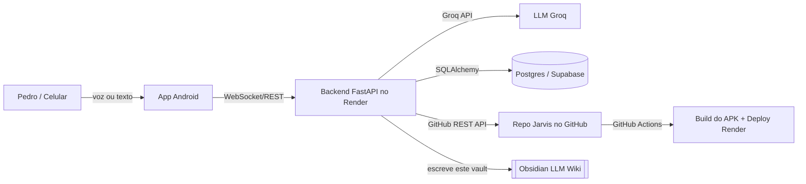

# Arquitetura do NEXUS AI

## Componentes
- **App Android** (Kotlin/Compose): chat, wake word, controle do aparelho, telas de
  ajustes/auto-melhoria/controle. Ver [[App Android]].
- **Backend FastAPI** (Render, Python 3.14): auth JWT, chat streaming, intenções,
  [[Auto-Melhoria]], [[Agendamentos e Lembretes]]. Ver [[Backend FastAPI]].
- **LLM Groq**: gera respostas e propõe mudanças de código.
- **Banco** (Postgres no Render, migrando para [[Super Base (Supabase)]]): usuários,
  conversas, mensagens, memória, lembretes, configurações, tarefas agendadas.
- **GitHub**: o backend escreve código via REST API (sem `git`); o CI gera o APK.
- **Obsidian**: este vault é a "memória externa" do projeto ([[Memória da IA]]).

## Fluxo de uma mensagem
1. App manda `{type:message, content}` pelo WebSocket `/api/ws/chat?token=...`.
2. Backend autentica, busca memória, chama Groq em streaming.
3. Resposta volta em deltas `{type:delta}` e é falada/mostrada no app.
4. Se o dono disser "auto melhore", dispara [[Auto-Melhoria]].

## Fluxo de auto-melhoria
Backend → GitHub REST API (PUT conteúdo) → GitHub Actions (APK) → Deploy Render.
Se o build falhar, **rollback automático** (ver [[Auto-Melhoria]]).
